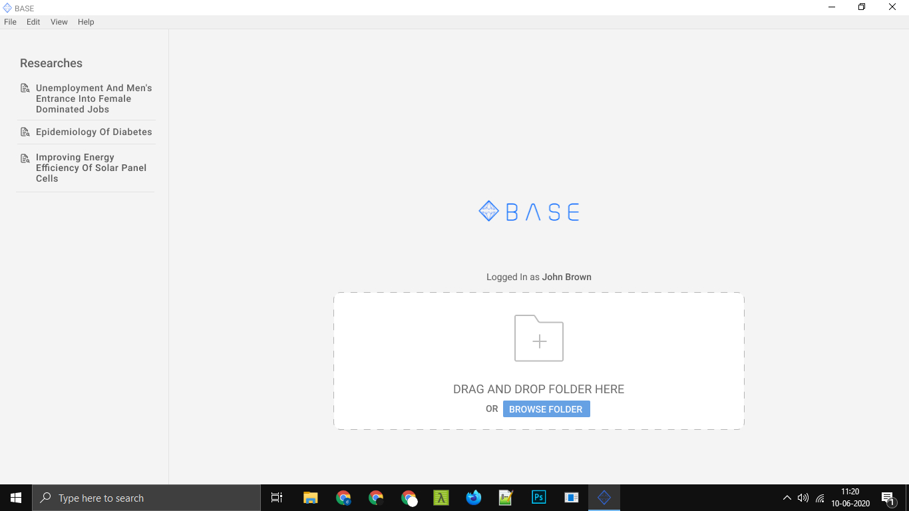
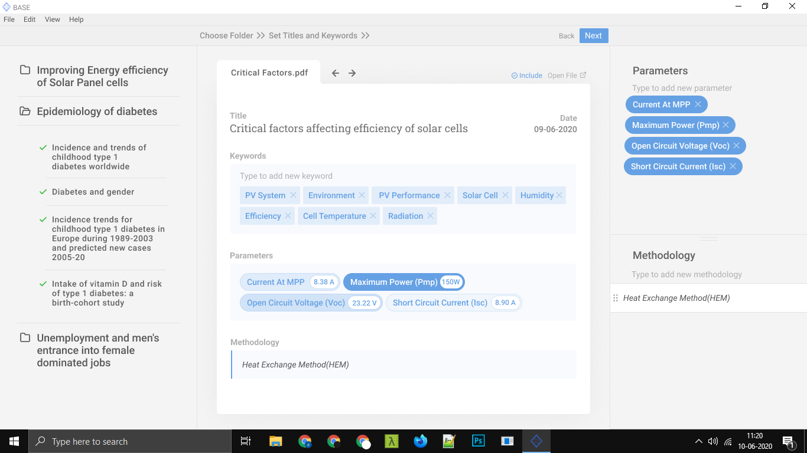
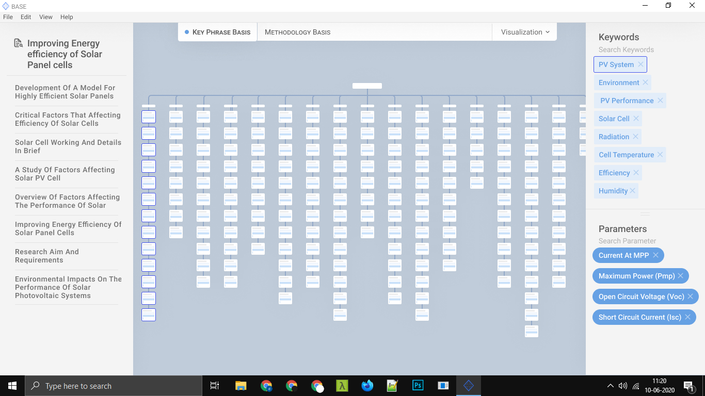
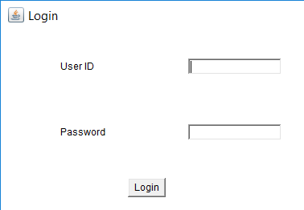
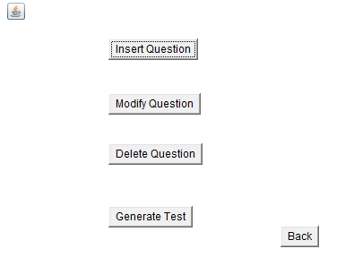
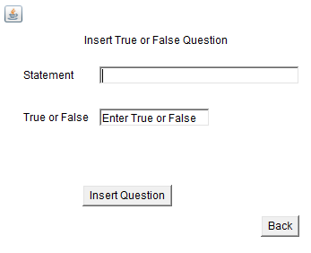
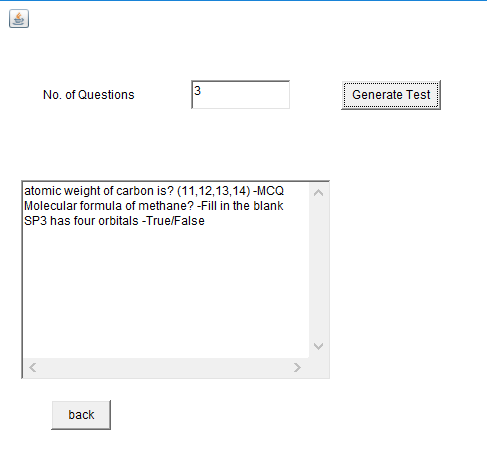

# Purna Srivatsa
*Software engineer | Virginia Tech | BITS Pilani*

# Education
* Masters of Engineering (Computer Science), *Virginia Tech*, 2021-2023
* Bachelors of Engineering (Electronics and Communication), BITS Pilani, 2015-2019

# [Project 1: Reasearch Visualizer web application](https://github.com/purnasrivatsa96/Base_did)

This project helps researchers manage and visualize the content of the papers in their literature review..
* **Frameworks and languages** NodeJs, ExpressJS, MongoDB, Jquery, AJAX, HTML/CSS
* **Input:** Research papers, Research repositories
* **Output:** A visual representation of the literature review

# [Project 2: Quiz Management app](https://github.com/purnasrivatsa96/Quiz-management-system-Java-)

An Android application in Java for conducting quizzes.
• Used Jquery mobile for frontend and SQLite to store and retreive data.
* **Frameworks and languages** Java, Android, SQLite
* **Input:** Questions and choice of subject
* **Output:** Stores added question into database and generates randomly chosen questions for quiz
